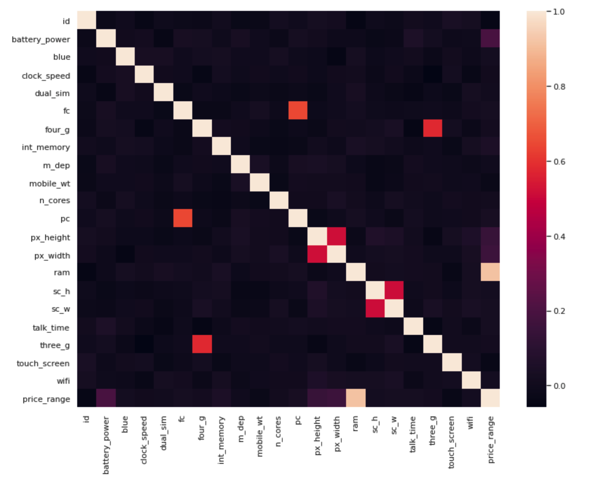
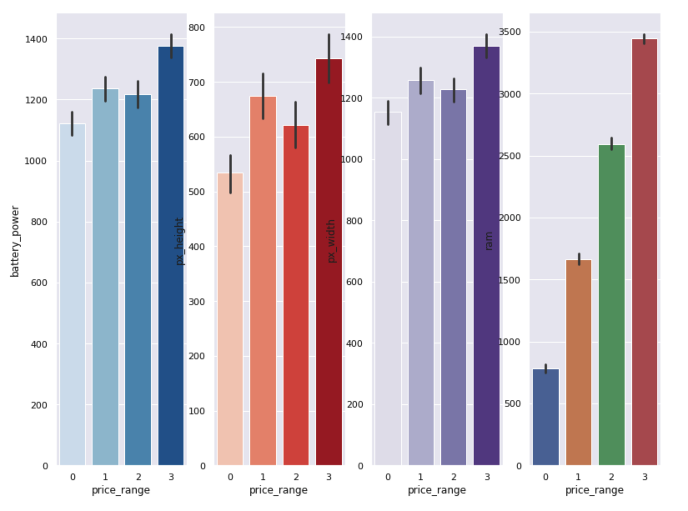

# mobile_price_prediction

This kaggle competition focuses on building a mcachine learning model that classifies the mobile into different price range in 4 different categories. 
The Data attributes included are:
* battery_power - Total energy a battery can store in one time measured in mAh
* blue - Has bluetooth or not
* clock_speed - speed at which microprocessor executes instructions
* dual_sim - Has dual sim support or not
* fc - Front Camera mega pixels
* four_g - Has 4G or not
* int_memory - Internal Memory in Gigabytes
* m_dep - Mobile Depth in cm
* mobile_wt - Weight of mobile phone
* n_cores - Number of cores of processor
* pc - Primary Camera mega pixels
* px_height - Pixel Resolution Height
* px_width - Pixel Resolution Width
* ram - Random Access Memory in Megabytes
* sc_h - Screen Height of mobile in cm
* sc_w - Screen Width of mobile in cm
* talk_time - longest time that a single battery charge will last when you are
* three_g - Has 3G or not
* touch_screen - Has touch screen or not
* wifi - Has wifi or not
* price_range - This is the target variable with value of 0(low cost), 1(medium cost), 2(high cost) and 3(very high cost).

Train data had 1800 rows and 21 columns

## Correlation matrix

From the heatmap, we can see significance correlation of the target variable with ram, bettery_power, pixel_width, pixel_height

## Barpot 

From the barplot, except ram, all other attributes have a dip in the plot for price range 2, this can be due to iphone models like 11 and XR who tightwad when it comes to adding features

